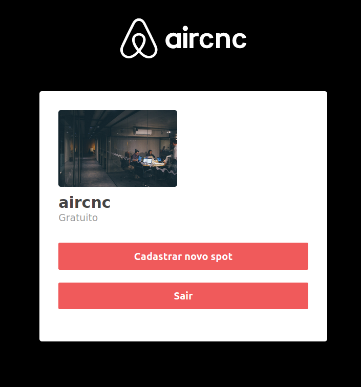

  

<h3 align="center">
  #rocketseat, #nodejs, #express, #mongoDB #react
</h3>

  

  

  <a href="#rocket-sobre-a-aplicação">Sobre a Aplicação</a>&nbsp;&nbsp;&nbsp;|&nbsp;&nbsp;&nbsp;
  <a href="#rocket-tecnologias-utilizadas">Tecnologias Utilizadas</a>&nbsp;&nbsp;&nbsp;|&nbsp;&nbsp;&nbsp;
  <a href="#rocket-instalação-e-execução"> Instalação e Execução</a>&nbsp;&nbsp;&nbsp;|&nbsp;&nbsp;&nbsp;
   <a href="#rocket-como-contribuir">Como Contribuir</a>

  
  
  

## :rocket: Sobre a Aplicação

Plataforma web onde as empresas podem cadastrar spots para receber outros desenvolvedores nos quais podem ser incríveis talentos e se unirem a empresa.

## :rocket: Tecnologias Utilizadas
- **NodeJS** — Um interpretador de javascript assíncrono
- **Express** - Estrutura para desenvolvimento de Backend em Nodejs
- **MongoDB** - Banco de dados não relacional
- **React** — Uma biblioteca para construir interfaces
- **Axios** — Requisições de API

## :rocket: Instalação e Execução

Faça um clone desse repositório.

### ⚔️ Backend

1. A partir da raiz do projeto, entre na pasta do backend rodando `cd backend`;
2. Rode `yarn` para instalar as dependências;
3. Rode `yarn dev` para iniciar o servidor.

### 🛡 Frontend Web

⚠️ Antes de executar, lembre-se de iniciar o backend deste projeto_

1. A partir da raiz do projeto, entre na pasta do frontend rodando `cd frontend`;
2. Rode `yarn` para instalar as dependências;
3. Rode `yarn start` para iniciar o client.

## :rocket: Como Contribuir

- Faça um fork desse repositório;
- Cria uma branch com a sua feature: `git checkout -b minha-feature`;
- Faça commit das suas alterações: `git commit -m 'feat: Minha nova feature'`;
- Faça push para a sua branch: `git push origin minha-feature`.
